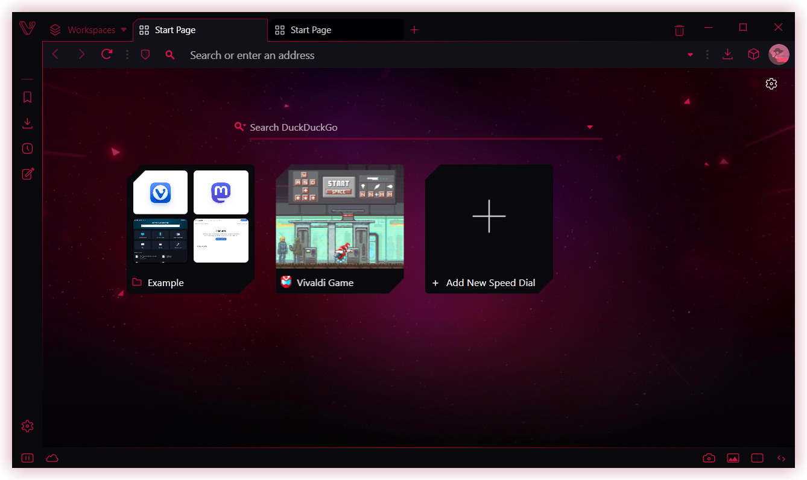
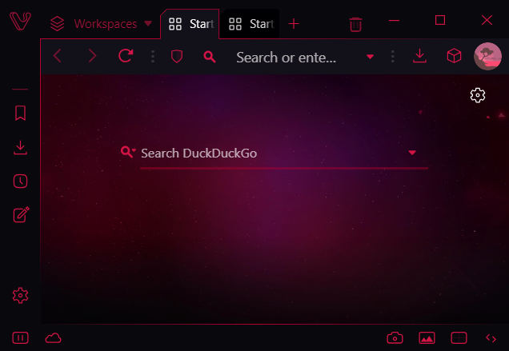
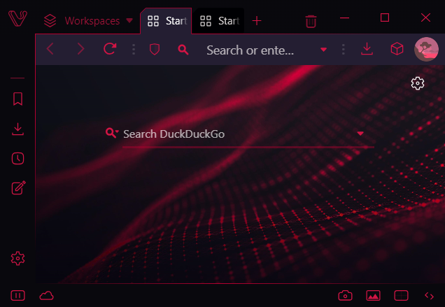
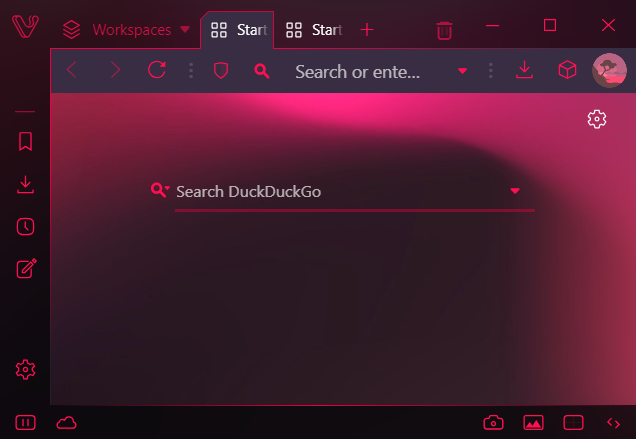

#  Vivaldi GX Revisited (Modified/Updated for 6.1)
An Opera GX style custom UI mod skin for Vivaldi.
- Originally created by [@gabevilela](https://forum.vivaldi.net/user/gabevilela) with help from [@tam710562](https://forum.vivaldi.net/user/tam710562) on the Vivaldi Forum and modified/updated to its current form by [@nomadic](https://forum.vivaldi.net/user/nomadic)
- Thanks to [@beyxnd](https://forum.vivaldi.net/user/beyxnd) for testing this mod through development and helping out with finding bugs and making suggestions
- Forum link **(original)**: https://forum.vivaldi.net/post/315382
- Forum link **(new)**:

***

***DISCLAIMER: This updated version deviates from the original mod. The original authors are not responsible for any of the differences between the two versions. All support queries should be directed at @nomadic on Vivaldi's Forum*** 

***DISCLAIMER: This mod wasn't developed and/or approved by either Opera Norway AS, or Vivaldi Technologies***

## Preview

## How to install?

1. **Enable CSS modifications** *(You need to do this only once)* 
Go in `vivaldi://experiments` and check `Allow for using CSS modifications`
2. **Download the mod** 
In this page, click on [`Releases`](https://github.com/ortiza5/Vivaldi-GX/releases), select a version and download the specified `ZIP`
3. Extract the `Mod` folder to anywhere safe on your PC, like the Documents folder
4. Open Vivaldi Settings > Appearance and in "Custom UI Modifications", select the downloaded `Mod` folder
5. Restart Vivaldi (you can easily do this by going in `vivaldi://restart`)

## Configuration

### Variables
- Under `.../Mod/sources/` there is a file `vars.css` that contains several CSS variables that you can modify to change the appearance of this mod
- **\*\*You should backup this file elsewhere to allow you to easily replace the contents of the `Mod` folder when this mod receives an update\*\***
- **Definitions**:
  - **`--GXbuttonFill`**
    - **Default Value**: `var(--colorHighlightBg)`
    - **Purpose**: Sets the color used to fill in the icons of the buttons across the UI
  - **`--GXbuttonBgHover`**
    - **Default Value**: `var(--colorAccentBgDark)`
    - **Purpose**: Sets the background color of buttons when they are hovered 
  - **`--GXborderColor`**
    - **Default Value**: `var(--colorHighlightBgDark)`
    - **Purpose**: Sets the color of the border that wraps around the perimeter of the UI
  - **`--GXpanelWidth`**
    - **Default Value**: `40px`
    - **Purpose**: Sets the width of the Panel Bar. Vivaldi's is narrower than Opera GX's by default, so this value increases its width
    - **Range**: Shouldn't go below `34px`, but can go as wide as you want above that
  - **`--GXaddressFieldSideBorders`**
    - **Default Value**: `⋮`
    - **Purpose**: Sets the side borders that define the edges of the unfocused Address Field. This mod makes the Field blend in with the Address Bar, so this icon is used to make its location more apparent
  - **`--GXaddressBarButtonFill`**
    - **Default Value**: `var(--GXbuttonFill)`
    - **Purpose**: Sets the color used to fill the icons of the buttons specifically on the Address Bar. Opera GX has varying icon colors depending on their location in the UI, so this allows you to match that
    - **Suggestion**: Set the variable to `var(--colorAccentFg)` to get the original look of Opera GX
  - **`--GXbookmarkBarButtonFill`**
    - **Default Value**: `var(--GXbuttonFill)`
    - **Purpose**: Sets the color used to fill the icons of the buttons specifically on the Bookmark Bar. Opera GX has varying icon colors depending on their location in the UI, so this allows you to match that
    - **Suggestion**: Set the variable to `var(--colorAccentFg)` to get the original look of Opera GX
  - **`--GXspeedDialSearchBgColor`**
    - **Default Value**: `transparent;
    - **Purpose**: Sets the background color of the unfocused Search Field on the Start Page above the Speed Dials
    - **Suggestion**: Set the variable to `var(--colorBg)` to get more contrast behind the Field

### Overrides
- If you want to change some aspect of this mod, but still want to be able to easily update in the future, then it is best to keep your changes concentrated in one place rather than intermingled throughout the mod
- To accomplish this, you can create a file called `overrides.css` under `.../Mod/sources/` and put all of your changes there
- **\*\*You should backup this file elsewhere to allow you to easily replace the contents of the `Mod` folder when this mod receives an update\*\***
- That file will be imported after the rest of the mod, so you should be able to easily override some of the mod's default styles and still use the defined variables
- The releases will not include an `override.css` file defined to avoid overwriting the file depending on how you choose to update the folder contents

## Companion Themes

- **Authentic Opera GX theme for those who like the classic GX look**
  - **Made by** - [@beyxnd](https://forum.vivaldi.net/user/beyxnd)
  - **Link for regular windows** - https://themes.vivaldi.net/themes/rwjvEVGpJAL
  - **Link for private windows** - https://themes.vivaldi.net/themes/NOb71q9371g
  - **Preview** - 
     | Regular | Private |
     | ------- | ------- |
     |  |  |
     
- **GX inspired, but with transparency**
  - **Made by** - [@nomadic](https://forum.vivaldi.net/user/nomadic)
  - **Link** - https://themes.vivaldi.net/themes/1LVJ2Z9xJx9
  - **Preview** -
     | Regular | Private |
     | ------- | ------- |
     |  |  |

## Known Limitations
- **Bar Placement Incompatibilities** - The Address and Tab Bars need to be set to the top position or hidden. I can work to enable these options, but I want to know there is demand before starting the work
- **Inconsistent Borders** - Some screen sizes, window positions, and scaling will cause borders to appear as different widths and occasionally produce gaps in the borders. I have tried my best to limit this, but in some cases it is unavoidable. Even Opera GX suffers some of these issues
- **Fade to Accent Bug** - If you have transparency enabled in your theme, the border underneath the main Tab Bar, when a 2 level tab stack is viewed, will fade into the accent color rather than to transparent. This is unavoidable because the accent color bar is used to cover up the top border and a transparent bar would be unable to fully cover it
- **Menu Icon Line Thickness** - The new menu icon has a line thickness of `1px`, which is thinner than the default Vivaldi icon pack of `1.5px`. This was done because Vivaldi's logo doesn't lend itself as well to the Opera GX style icon without looking crowded. All the companion themes for this mod include an icon pack with thinner `1px` icons
- **`modSettings.css` Lies** - Inside `modSettings.css`, it says you can turn off certain parts of the mod by commenting out their import lines. This isn't fully true at this point. The UI components are not fully independent of each other, so some can't be disabled without affecting the other parts. If you want, you can try disabling parts as you want, but it isn't fully supported at this time